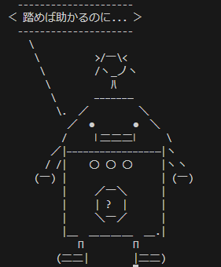

「踏めば助かるのに...」でおなじみのロボカスに何でも言わせることが出来ます。

## 使い方
```bash
gcc main.c -o robokssay
./robokssay "セリフ"
```

### Dockerを使って実行する場合
以下のようにビルドします。
```bash
docker build . -t robokssay
```

実行は以下のようにします。
```bash
docker run robokssay robokssay
```

### Nixを使って実行する場合

実行は以下のようにします。

```bash
nix run github:7-rate/robokssay#robokssay
```

## Result Example

